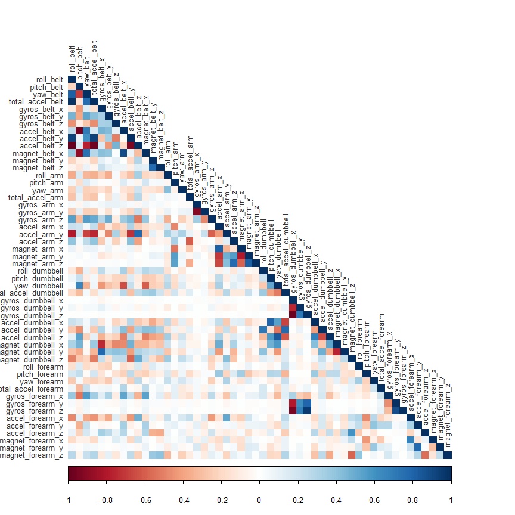
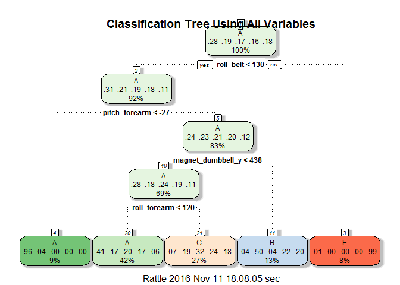

# Practical Machine Learning
Fenton Taylor  
November 9, 2016  


##__I. Introduction__
The purpose of this exercise is to find a prediction model, using machine learning algorithms,
to perform qualitative activity recognition. The data comes from Velloso, et al.'s publication entitled "Qualitative Activity Recognition of Weight Lifting Exercises" as part of their Human Activity Recognition research. Their publications and datasets are free and open to the public and can be found at the following link: [Read more here.](http://groupware.les.inf.puc-rio.br/har#ixzz4PXRAjZK1)

In this particular study, as described on the author's website, "six young health participants were asked to perform one set of 10 repetitions of the Unilateral Dumbbell Biceps Curl in five different fashions: exactly according to the specification (Class A), throwing the elbows to the front (Class B), lifting the dumbbell only halfway (Class C), lowering the dumbbell only halfway (Class D) and throwing the hips to the front (Class E)." Participants were fitted with four accelerometer devices to measure kinetic movement. The devices were located on a waist belt, an upper arm band, a glove, and a dumbbell.

##__II. Getting and Cleaning the Data__
###__A. Load Libraries__


```r
library(caret)
library(rattle)
library(corrplot)
```

###__B. Download Files__

```r
if(!file.exists("pml-training.csv")){
      download.file("https://d396qusza40orc.cloudfront.net/predmachlearn/pml-training.csv",
                    destfile = "pml-training.csv")
}

if(!file.exists("pml-testing.csv")){
      download.file("https://d396qusza40orc.cloudfront.net/predmachlearn/pml-testing.csv",
                    destfile = "pml-testing.csv")
}

training <- read.csv("pml-training.csv", na.strings = c("", NA))
testing <- read.csv("pml-testing.csv", na.strings = c("", NA))
```

###__C. Transforming the Data__
The data needs to be cleaned so that the variables are all relevant predictors and the machine learning algorithms can process them more efficiently. Both the original training and testing datasets receive the following transformations:

1. Randomly sort the training data so that k-fold cross-validation can be used.
2. Remove any columns with more that 75% NA values.
3. Remove the first 7 columns that contain meta-data about the testing subject and measurements. These variables are not relevant to the prediction.

Finally, using random subsampling, the original training set needs to be split into smaller training and testing sets (60% and 40%, respectively) to build and test the accuracy of the models.


```r
# Transformation 1
myTrain <- training[sample(1:nrow(training)),]

# Transformation 2
myTrain <- myTrain[, colSums(is.na(training)) < nrow(training) * 0.75]
myTest <- testing[, colSums(is.na(testing)) < nrow(testing) * 0.75]

# Transformation 3
myTrain <- myTrain[, -c(1:7)]
myTest <- myTest[, -c(1:7)]

set.seed(432)
inTrain <- createDataPartition(y=myTrain$classe, p=0.6, list=FALSE)
tra <- myTrain[inTrain,]
tes <- myTrain[-inTrain,]
```

##__III. Exploratory Analysis__
The data needs to be checked to see if any further transformation is necessary before attempting to build models with it.
###__A. Basic__
Dimensions of the training and testing set made from the training set:

```r
dim(tra); dim(tes)
```

```
## [1] 11776    53
```

```
## [1] 7846   53
```

Check if there are any NA values left in the traing or test set that need to be imputed. TRUE = no NA.

```r
all(colSums(is.na(tra))==0); all(colSums(is.na(tes))==0)
```

```
## [1] TRUE
```

```
## [1] TRUE
```

Check to see if any variables have near zero variance. If FALSE, then there are no variables with near zero variance.

```r
any(nearZeroVar(tra, saveMetrics = TRUE)$nzv)
```

```
## [1] FALSE
```

###__B. Correlation Analysis__


```r
corrs <- cor(tra[,-53])
corrplot(corrs, method="color", order="original", type="lower", tl.cex = 0.8, tl.col="grey20")
```



There appear to be several variables that are highly correlated (the dark squares in the plot), but the majority of the correlations do not appear to be a cause for concern. Therefore, the variables will remain unaltered for the initial model building.

The remaining variables should now be only measurements collected from the devices (with no NA values) and the class of the exercise performed. The data is now ready to build and test models on.

##__IV. Model Building__
All models will use k-fold cross-validation with $k=5$. 

###__Method 1: Classification Tree__

```r
set.seed(111)
system.time(mod.ct <- train(x=tra[,-53], y=tra$classe, method="rpart",
                trControl=trainControl(method="cv", number=5)))
```

```
##    user  system elapsed 
##    6.72    0.14    6.88
```


```r
mod.ct$finalModel
```

```
## n= 11776 
## 
## node), split, n, loss, yval, (yprob)
##       * denotes terminal node
## 
##  1) root 11776 8428 A (0.28 0.19 0.17 0.16 0.18)  
##    2) roll_belt< 130.5 10792 7451 A (0.31 0.21 0.19 0.18 0.11)  
##      4) pitch_forearm< -26.75 1075   43 A (0.96 0.04 0 0 0) *
##      5) pitch_forearm>=-26.75 9717 7408 A (0.24 0.23 0.21 0.2 0.12)  
##       10) magnet_dumbbell_y< 437.5 8175 5921 A (0.28 0.18 0.24 0.19 0.11)  
##         20) roll_forearm< 119.5 4977 2961 A (0.41 0.17 0.2 0.17 0.059) *
##         21) roll_forearm>=119.5 3198 2182 C (0.074 0.19 0.32 0.24 0.18) *
##       11) magnet_dumbbell_y>=437.5 1542  773 B (0.036 0.5 0.043 0.22 0.2) *
##    3) roll_belt>=130.5 984    7 E (0.0071 0 0 0 0.99) *
```

```r
# Use model to predict classe in testing set
pred.ct <- predict(mod.ct, newdata=tes)

fancyRpartPlot(mod.ct$finalModel, main = "Classification Tree Using All Variables")
```

<!-- -->

```r
cm.ct <- confusionMatrix(pred.ct, tes$classe)

# Table of predicted vs. actual exercise classes
cm.ct$table
```

```
##           Reference
## Prediction    A    B    C    D    E
##          A 2028  658  610  570  225
##          B   31  507   42  237  183
##          C  166  353  716  479  380
##          D    0    0    0    0    0
##          E    7    0    0    0  654
```

```r
# Overall accuracy statistics
round(cm.ct$overall, 3)
```

```
##       Accuracy          Kappa  AccuracyLower  AccuracyUpper   AccuracyNull 
##          0.498          0.343          0.487          0.509          0.284 
## AccuracyPValue  McnemarPValue 
##          0.000            NaN
```

####__Analysis__
The simple classification tree with all the measurement variables as predictors obtains only 49.8% out of sample accuracy when applied to the testing set. That is quite poor predictive power, so other algorithms need to be explored.

###__Method 2: Random Forests__


```r
set.seed(222)
system.time(mod.rf <- train(x=tra[,-53], y=tra$classe, method="rf",
                trControl=trainControl(method="cv", number=5)))
```

```
##    user  system elapsed 
##  632.19    3.30  639.03
```


```r
mod.rf$finalModel
```

```
## 
## Call:
##  randomForest(x = x, y = y, mtry = param$mtry) 
##                Type of random forest: classification
##                      Number of trees: 500
## No. of variables tried at each split: 27
## 
##         OOB estimate of  error rate: 0.78%
## Confusion matrix:
##      A    B    C    D    E class.error
## A 3344    3    0    0    1 0.001194743
## B   18 2256    5    0    0 0.010092146
## C    0   12 2034    8    0 0.009737098
## D    0    0   28 1900    2 0.015544041
## E    0    3    6    6 2150 0.006928406
```

```r
# Use model to predict classe in testing set
pred.rf <- predict(mod.rf, newdata=tes)

cm.rf <- confusionMatrix(pred.rf, tes$classe)

# Table of predicted vs. actual exercise classes
cm.rf$table
```

```
##           Reference
## Prediction    A    B    C    D    E
##          A 2232    5    0    0    0
##          B    0 1509    1    1    2
##          C    0    4 1367    5    0
##          D    0    0    0 1280    4
##          E    0    0    0    0 1436
```

```r
# Overall accuracy statistics
round(cm.rf$overall, 3)
```

```
##       Accuracy          Kappa  AccuracyLower  AccuracyUpper   AccuracyNull 
##          0.997          0.996          0.996          0.998          0.284 
## AccuracyPValue  McnemarPValue 
##          0.000            NaN
```

####__Analysis__
The random forest algorithm provides a very accurate model with 99.7% out of sample accuracy. The only downside is that it is computationally inefficient and not easily interpretable.

###__Method 3: Generalized Boosted Model__

```r
set.seed(333)
system.time(mod.gbm <- train(x=tra[,-53], y=tra$classe, method="gbm",
                trControl=trainControl(method="cv", number=5),
                verbose=FALSE))
```

```
##    user  system elapsed 
##  260.88    0.41  261.81
```


```r
mod.gbm$finalModel
```

```
## A gradient boosted model with multinomial loss function.
## 150 iterations were performed.
## There were 52 predictors of which 42 had non-zero influence.
```

```r
mod.gbm
```

```
## Stochastic Gradient Boosting 
## 
## 11776 samples
##    52 predictor
##     5 classes: 'A', 'B', 'C', 'D', 'E' 
## 
## No pre-processing
## Resampling: Cross-Validated (5 fold) 
## Summary of sample sizes: 9420, 9422, 9421, 9421, 9420 
## Resampling results across tuning parameters:
## 
##   interaction.depth  n.trees  Accuracy   Kappa    
##   1                   50      0.7509337  0.6842316
##   1                  100      0.8209056  0.7732033
##   1                  150      0.8528361  0.8137474
##   2                   50      0.8559790  0.8174687
##   2                  100      0.9090517  0.8849060
##   2                  150      0.9329144  0.9150935
##   3                   50      0.8967397  0.8692777
##   3                  100      0.9426799  0.9274587
##   3                  150      0.9601734  0.9496114
## 
## Tuning parameter 'shrinkage' was held constant at a value of 0.1
## 
## Tuning parameter 'n.minobsinnode' was held constant at a value of 10
## Accuracy was used to select the optimal model using  the largest value.
## The final values used for the model were n.trees = 150,
##  interaction.depth = 3, shrinkage = 0.1 and n.minobsinnode = 10.
```

```r
# Use model to predict classe in testing set
pred.gbm <- predict(mod.gbm, newdata=tes[,-53], n.trees=150)
cm.gbm <- confusionMatrix(pred.gbm, tes$classe)

# Table of predicted vs. actual exercise classes
cm.gbm$table
```

```
##           Reference
## Prediction    A    B    C    D    E
##          A 2208   48    0    1    0
##          B   19 1433   29    5   13
##          C    3   36 1326   34   13
##          D    2    0   11 1242   18
##          E    0    1    2    4 1398
```

```r
# Overall accuracy statistics
round(cm.gbm$overall, 3)
```

```
##       Accuracy          Kappa  AccuracyLower  AccuracyUpper   AccuracyNull 
##          0.970          0.961          0.965          0.973          0.284 
## AccuracyPValue  McnemarPValue 
##          0.000            NaN
```

####__Analysis__
Generalized boosting model gave a fairly good predictive model at 97% out of sample accuracy. It was not quite as good as random forest, but it was much faster computationally.

##__V. Model Selection and Testing Prediction__

The three models had the following accuracy when used to predict on the testing set that was a subsample of the training set:
      
      1. Classification Tree: 49.8%
      2. Random Forest: 99.7%
      3. Boosting: 97%

Random Forest will be used because it has the best accuracy, although boosting did a pretty good job as well. The following are the final predictions associated with their problem id numbers.


```r
pred.final <- predict(mod.rf, myTest)
answers <- data.frame(ProblemID=myTest$problem_id, Prediction=pred.final)
answers
```

```
##    ProblemID Prediction
## 1          1          B
## 2          2          A
## 3          3          B
## 4          4          A
## 5          5          A
## 6          6          E
## 7          7          D
## 8          8          B
## 9          9          A
## 10        10          A
## 11        11          B
## 12        12          C
## 13        13          B
## 14        14          A
## 15        15          E
## 16        16          E
## 17        17          A
## 18        18          B
## 19        19          B
## 20        20          B
```


##Sources
Velloso, E.; Bulling, A.; Gellersen, H.; Ugulino, W.; Fuks, H. Qualitative Activity Recognition of Weight Lifting Exercises. Proceedings of 4th International Conference in Cooperation with SIGCHI (Augmented Human '13) . Stuttgart, Germany: ACM SIGCHI, 2013.


~~~
